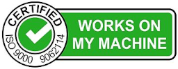

# Works on My Machine

Welcome!
This project helps you confirm that your development environment is properly set up for the interview.
Follow the instructions below to ensure everything works as expected and get WOMM certified today!

## Requirements

You'll need the following software installed on your machine, along with a [GitHub](https://github.com/) account:

1. **Zoom** (with working screen sharing)
2. **Text editor/IDE** (e.g., Vim, Emacs, VS Code, IntelliJ)
3. **Web browser** (e.g., Firefox, Chrome, Safari)
4. **Git** (preferably 2.47 or newer)
5. **Docker** (preferably 27.3 or newer)
6. **Docker Compose** (preferably 2.30 or newer)
7. **cURL** (preferably 8.11 or newer)

## Instructions

### 1. Clone the repository

Clone this repository to your local machine:

```console
git clone https://github.com/dss-interviews/womm.git
cd womm
```

### 2. Run the containers

Start the Docker containers using Docker Compose:

```console
docker compose up -d
```

### 3. Test the endpoint

Verify that the containers are running correctly by making a `curl` request:

```console
curl http://localhost:8080
```

You should see the "It works!" page HTML.

### 4. Clean up

Shut down the environment:

```console
docker compose down
```

## WOMM Certification

If you've successfully completed the steps above, you've earned the prestigious **Works on My Machine™** certification!



Well done!
You're now ready for the interview.

---

If you're having trouble with any of the steps above, please reach out to the Talent Acquisition team for assistance.
